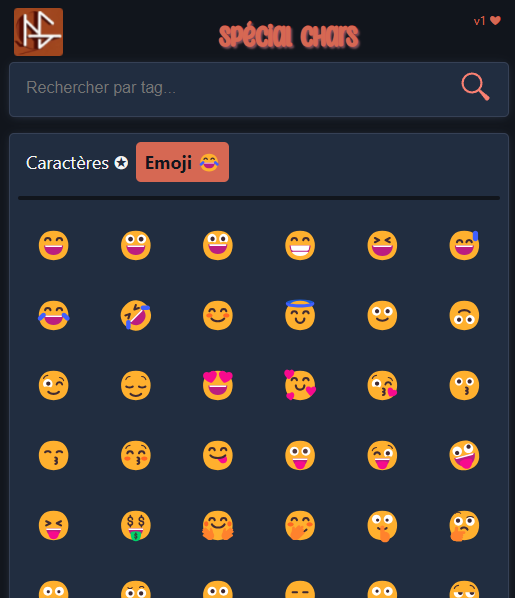

#  Special chars

With Special chars, you can :

* Pick and paste an spécial characters
* Pick and paste an emoji
* Search by tags what you want

## Preview

## How to install

1) Open your extensions manager tab (`<browser>://extensions`)
2) Enable "Developper Mode"
3) Drag and drop the downloaded zip file into the tab
4) Once uploaded and loaded, disable "Developper Mode"
5) Have fun using "Special Chars" ! 😸
